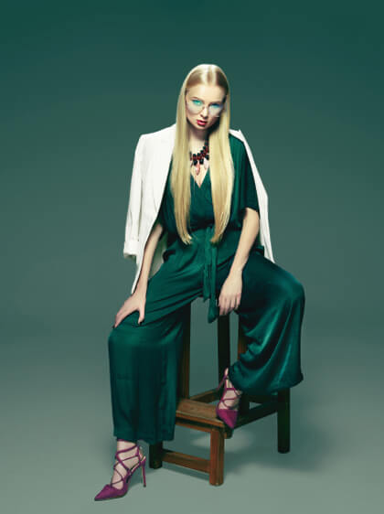

# LV_Clicks Photography Website

## Project Overview

LV_Clicks is a professional photography agency website built using the Kimono Photography template. This document provides a comprehensive guide to the project structure and development guidelines.

---

## 📁 Project Structure

```
Website_LVClicks/
│
├── index.html                 # Home page
├── gallery.html               # Gallery page (Images & Videos)
├── our-works.html            # Albums listing page
├── album-detail.html         # Album detail page
│
├── assets/                    # All static assets
│   ├── css/                   # Stylesheets
│   │   ├── main.css          # Main stylesheet (imports all CSS)
│   │   ├── global.css        # Global styles
│   │   ├── header.css        # Header styles
│   │   ├── footer.css        # Footer styles
│   │   ├── portfolio.css     # Portfolio/Gallery styles
│   │   ├── components.css    # Component styles
│   │   ├── animation.css     # Animation styles
│   │   ├── responsive.css    # Responsive styles
│   │   └── ...               # Other CSS files
│   │
│   ├── js/                    # JavaScript files
│   │   ├── jquery-3.6.0.min.js
│   │   ├── bootstrap.min.js
│   │   ├── theme.js          # Main theme JavaScript
│   │   └── map.js            # Map functionality
│   │
│   ├── img/                   # Images directory
│   │   ├── background/       # Background images
│   │   ├── projects/         # Project/Album images
│   │   │   ├── 1/            # Album 1 images
│   │   │   ├── 4/            # Album 4 images
│   │   │   ├── details/      # Detail page images
│   │   │   └── gallery/      # Gallery images
│   │   ├── slider/           # Slider images
│   │   ├── team/             # Team member photos
│   │   ├── testimonial/      # Testimonial photos
│   │   ├── instagram/        # Instagram feed images
│   │   ├── services/         # Service icons/images
│   │   └── more/             # Decorative elements
│   │
│   └── fonts/                 # Font files
│       └── bootstrap-icons-1.1/
│
└── plugins/                   # Third-party plugins
    ├── swiper/                # Swiper slider
    ├── fancybox/              # Lightbox plugin
    ├── isotope/               # Masonry layout
    ├── wow/                   # Scroll animations
    ├── odometer/              # Counter animations
    ├── cursor-effect/         # Custom cursor
    └── ...                    # Other plugins
```

---

## 🎯 Current Pages

### 1. **index.html** - Home Page
- Hero slider section
- Services section
- Image gallery section (with lightbox)
- Testimonials
- Contact form

### 2. **gallery.html** - Gallery Page
- **Images Section**: Masonry grid layout with Fancybox lightbox
- **Videos Section**: Video players with Fancybox modal (YouTube/Vimeo)
- Contact form

### 3. **our-works.html** - Albums Listing
- Albums grid with masonry layout
- Each album shows thumbnail, title, and photo count
- Links to album detail pages

### 4. **album-detail.html** - Album Detail Page
- Swiper slider for featured images
- Image grid with Fancybox lightbox
- Album information sidebar
- Share buttons

---

## 🛠️ Development Guidelines

### Creating a New Page

#### Step 1: Copy Base Template
```bash
# Copy an existing page as a starting point
cp index.html new-page.html
```

#### Step 2: Update Page Metadata
Update the `<head>` section:

```html
<head>
    <!-- Meta Tags -->
    <meta charset="utf-8">
    <meta http-equiv="X-UA-Compatible" content="IE=edge">
    <meta name="viewport" content="width=device-width, initial-scale=1, maximum-scale=1, user-scalable=0">
    <meta name="description" content="LV_Clicks - Your Page Description">
    <meta name="author" content="">

    <!-- Favicon -->
    <link href="assets/img/favicon.png" rel="shortcut icon" type="image/png">

    <!-- Page Title -->
    <title>Page Name - LV_Clicks Photography</title>
    
    <!-- Styles Include -->
    <link rel="stylesheet" href="assets/css/main.css">
</head>
```

#### Step 3: Update Navigation Menu
Find the navigation menu and update it:

```html
<ul class="main-menu">
    <li class="menu-item"><a href="index.html">Home</a></li>
    <li class="menu-item"><a href="gallery.html">Gallery</a></li>
    <li class="menu-item"><a href="our-works.html">Our Works</a></li>
    <li class="menu-item"><a href="new-page.html" class="active">New Page</a></li>
</ul>
```

#### Step 4: Replace Main Content
Replace the content inside `<main class="wrapper">` with your new content.

#### Step 5: Update Footer (if needed)
Footer is usually consistent across pages, but update links if necessary.

---

## 🎨 Using Template Components

### Page Header
```html
<!-- Page Header -->
<div class="wptb-page-heading">
    <div class="wptb-item--inner" style="background-image: url('assets/img/background/bg-3.jpg');">
        <div class="wptb-item-layer wptb-item-layer-one">
            
        </div>
        <h2 class="wptb-item--title">Your Page Title</h2>
    </div>
</div>
```

### Section Heading
```html
<div class="wptb-heading-two">
    <div class="wptb-item--inner text-center">
        <h6 class="wptb-item--subtitle">Subtitle</h6>
        <h1 class="wptb-item--title">Main Title <span>Highlighted</span></h1>
        <div class="wptb-item--description">
            Description text here.
        </div>
    </div>
</div>
```

### Image Gallery with Lightbox
```html
<div class="grid grid-3 gutter-10 clearfix">
    <div class="grid-sizer"></div>
    <div class="grid-item">
        <div class="wptb-item--inner">
            <div class="wptb-item--image">
                
                <a class="wptb-image-popup" href="assets/img/projects/1/1.jpg" data-fancybox="gallery-name">
                    <i class="bi bi-arrows-fullscreen"></i>
                </a>
            </div>
        </div>
    </div>
</div>
```

**Important**: All images in the same gallery should use the same `data-fancybox="gallery-name"` value.

### Video Player
```html
<div class="wptb-video-player1" style="background-image: url('assets/img/background/bg-3.jpg');">
    <div class="wptb-item--inner">
        <div class="wptb-item--holder">
            <div class="wptb-item--video-button">
                <a class="btn" data-fancybox href="https://www.youtube.com/watch?v=VIDEO_ID">
                    <span class="text-second"> <i class="bi bi-play-fill"></i> </span>
                    <span class="line-video-animation line-video-1"></span>
                    <span class="line-video-animation line-video-2"></span>
                    <span class="line-video-animation line-video-3"></span>
                </a>
            </div>
            <h4 class="wptb-item--title">Video Title</h4>
        </div>
    </div>
</div>
```

### Swiper Slider
```html
<div class="swiper-container swiper-gallery">
    <div class="swiper-wrapper">
        <div class="swiper-slide">
            <figure class="block-gallery">
                
            </figure>
        </div>
        <!-- More slides -->
    </div>
    
    <!-- Navigation -->
    <div class="wptb-swiper-navigation style2">
        <div class="wptb-swiper-arrow swiper-button-prev"></div>
        <div class="wptb-swiper-arrow swiper-button-next"></div>
    </div>
</div>
```

### Contact Form
```html
<section class="wptb-contact-form style2">
    <div class="wptb-item-layer both-version">
        
        
    </div>
    <div class="container">
        <div class="wptb-form--wrapper no-bg">
            <div class="row">
                <div class="col-lg-5">
                    <div class="wptb-heading-two pe-lg-5">
                        <div class="wptb-item--inner">
                            <h6 class="wptb-item--subtitle">Contact Us</h6>
                            <h1 class="wptb-item--title">Feel Free To Ask Us Anything <span>Contact Us</span></h1>
                        </div>
                    </div>
                </div>
                <div class="col-lg-7">
                    <form class="wptb-form" action="#" method="post">
                        <!-- Form fields -->
                    </form>
                </div>
            </div>
        </div>
    </div>
</section>
```

### Button Styles
```html
<!-- Primary Button -->
<a class="btn" href="#">
    <span class="btn-wrap">
        <span class="text-first">Button Text</span>
        <span class="text-second"><i class="bi bi-arrow-up-right"></i> <i class="bi bi-arrow-up-right"></i></span>
    </span>
</a>

<!-- Secondary Button -->
<a class="btn btn-two" href="#">
    <span class="btn-wrap">
        <span class="text-first">Button Text</span>
    </span>
</a>
```

---

## 📐 Layout Patterns

### Masonry Grid Layout
```html
<div class="style-masonry effect-blur">
    <div class="grid grid-3 gutter-10 clearfix">
        <div class="grid-sizer"></div>
        <div class="grid-item">
            <!-- Content -->
        </div>
    </div>
</div>
```

**Grid Classes:**
- `grid-2` - 2 columns
- `grid-3` - 3 columns
- `grid-4` - 4 columns

**Effect Classes:**
- `effect-blur` - Blur effect on hover
- `effect-fly` - Fly effect
- `effect-tilt` - Tilt effect
- `effect-gradient` - Gradient effect

### Standard Grid Layout
```html
<div class="row">
    <div class="col-lg-4 col-md-6">
        <!-- Content -->
    </div>
</div>
```

---

## 🖼️ Image Management

### Image Paths
Always use relative paths from the HTML file:
- From root: `assets/img/projects/1/1.jpg`
- From subdirectory: `../assets/img/projects/1/1.jpg` (if in subfolder)

### Image Directories
- **Projects/Albums**: `assets/img/projects/[album-number]/`
- **Gallery**: `assets/img/projects/gallery/`
- **Details**: `assets/img/projects/details/`
- **Backgrounds**: `assets/img/background/`
- **Team**: `assets/img/team/`
- **Testimonials**: `assets/img/testimonial/`

### Adding New Images
1. Place images in appropriate directory
2. Use descriptive filenames (e.g., `wedding-album-1.jpg`)
3. Optimize images before adding (recommended: WebP or optimized JPG)
4. Update image references in HTML

---

## 🎭 Branding Guidelines

### Brand Name
- Always use: **LV_Clicks** (with underscore)
- Never use: "LV Clicks", "lvclicks", or variations

### Logo
Currently using text logo:
```html
<a href="index.html" class="light_logo">
    <span class="logo-text">LV_Clicks</span>
</a>
```

### Color Scheme
- Primary colors are defined in CSS files
- Use Bootstrap utility classes for colors
- Maintain consistency across pages

---

## 🔧 JavaScript Plugins

### Required Scripts (in order)
```html
<!-- jQuery -->
<script src="assets/js/jquery-3.6.0.min.js"></script>

<!-- Bootstrap -->
<script src="assets/js/bootstrap.min.js"></script>

<!-- Swiper -->
<script src="plugins/swiper/swiper-bundle.min.js"></script>

<!-- Fancybox -->
<script src="plugins/fancybox/jquery.fancybox.min.js"></script>

<!-- Isotope (for masonry) -->
<script src="plugins/isotope/imagesloaded.pkgd.min.js"></script>
<script src="plugins/isotope/isotope.pkgd.min.js"></script>
<script src="plugins/isotope/isotope-init.js"></script>

<!-- WOW (animations) -->
<script src="plugins/wow/wow.min.js"></script>

<!-- Theme JS -->
<script src="assets/js/theme.js"></script>
```

### Initializing Plugins
Most plugins are auto-initialized in `theme.js`. For custom initialization:

```javascript
// Swiper
var swiper = new Swiper('.swiper-container', {
    // options
});

// Fancybox
$('[data-fancybox]').fancybox({
    // options
});

// Isotope
var $grid = $('.grid').isotope({
    // options
});
```

---

## 📱 Responsive Design

### Breakpoints
- **Mobile**: < 576px
- **Tablet**: 576px - 991px
- **Desktop**: 992px - 1199px
- **Large Desktop**: ≥ 1200px

### Bootstrap Grid Classes
```html
<div class="col-lg-4 col-md-6 col-sm-12">
    <!-- Responsive column -->
</div>
```

### Testing
Always test pages on:
- Desktop (1920px, 1366px)
- Tablet (768px)
- Mobile (375px, 414px)

---

## 🎨 CSS Customization

### Custom Styles
Add custom styles in the `<head>` section:

```html
<style>
    .custom-class {
        /* Your styles */
    }
</style>
```

### Overriding Template Styles
Use more specific selectors or `!important` (sparingly):

```css
.wptb-item--title {
    color: #your-color !important;
}
```

### Theme Classes
- `theme-style--gradient` - Gradient theme
- `theme-style--dark` - Dark theme
- `theme-style--light` - Light theme

---

## ✅ Best Practices

### 1. File Naming
- Use lowercase with hyphens: `new-page.html`
- Descriptive names: `wedding-gallery.html` not `page1.html`

### 2. Code Organization
- Keep HTML structure consistent
- Use semantic HTML5 elements
- Add comments for major sections

### 3. Image Optimization
- Compress images before adding
- Use appropriate formats (JPG for photos, PNG for graphics)
- Maintain aspect ratios

### 4. Accessibility
- Always include `alt` text for images
- Use proper heading hierarchy (h1 → h2 → h3)
- Ensure color contrast meets WCAG standards

### 5. Performance
- Minimize HTTP requests
- Lazy load images when possible
- Optimize JavaScript loading

### 6. Browser Compatibility
- Test in Chrome, Firefox, Safari, Edge
- Use vendor prefixes when needed
- Test on mobile devices

---

## 🔍 Finding Template Components

### Template Location
Original template files are in: `Template-kimono/dark/`

### Common Page Types
- **Home Pages**: `index.html`, `index-2.html`, `index-3.html`, etc.
- **Gallery/Projects**: `project-general.html`, `project-masonry-1.html`, etc.
- **Details**: `project-details.html`, `project-details-2.html`
- **Services**: `services-1.html`, `service-details.html`
- **Team**: `team-1.html`, `team-details.html`

### Component Search
1. Open template file in `Template-kimono/dark/`
2. Find the component you need
3. Copy the HTML structure
4. Adapt to LV_Clicks branding
5. Update image paths

---

## 🚀 Deployment Checklist

Before deploying:

- [ ] All image paths are correct
- [ ] Navigation links work
- [ ] Forms are functional (if applicable)
- [ ] All pages are responsive
- [ ] Browser testing completed
- [ ] Meta tags updated
- [ ] Favicon included
- [ ] Copyright notices removed/updated
- [ ] Branding consistent across pages

---

## 📞 Support & Resources

### Template Documentation
Refer to the original template documentation for advanced features.

### Bootstrap Documentation
- [Bootstrap 5 Docs](https://getbootstrap.com/docs/5.0/)

### Plugin Documentation
- [Swiper](https://swiperjs.com/)
- [Fancybox](https://fancyapps.com/fancybox/)
- [Isotope](https://isotope.metafizzy.co/)

---

## 📝 Notes

- Always maintain the header and footer structure
- Keep navigation menu consistent across pages
- Update active menu item class (`active`) for current page
- Remove or replace any "Kimono" branding references
- Use LV_Clicks branding consistently

---

**Last Updated**: December 2024
**Version**: 1.0

